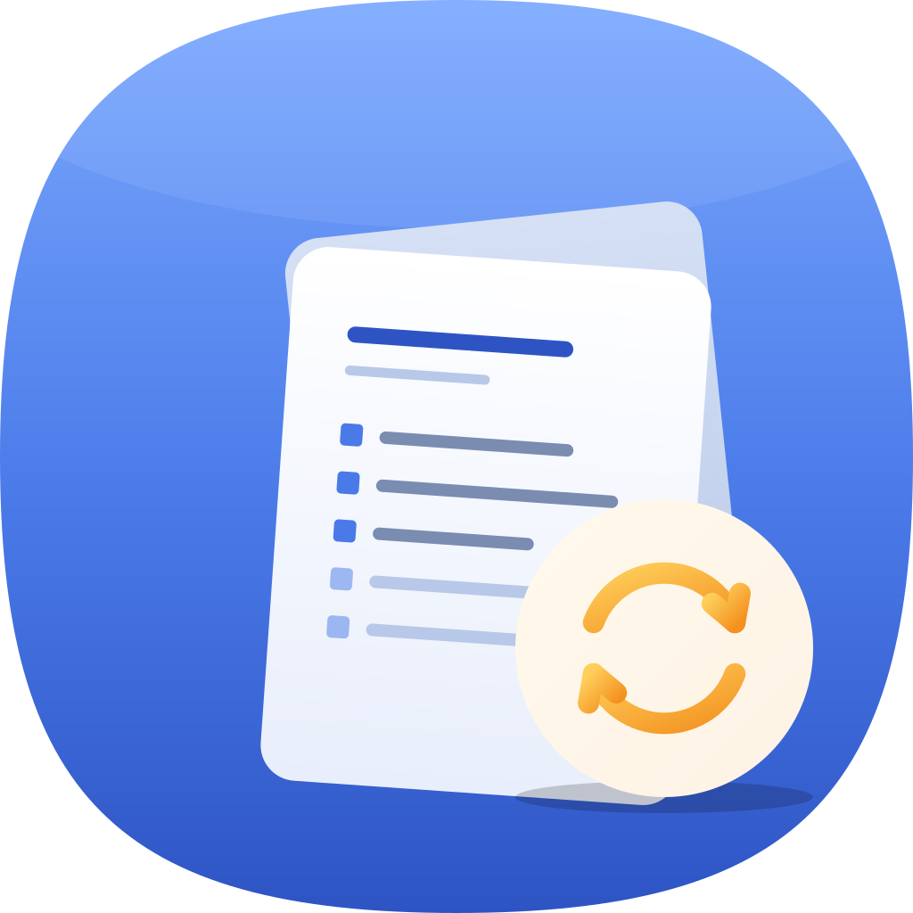
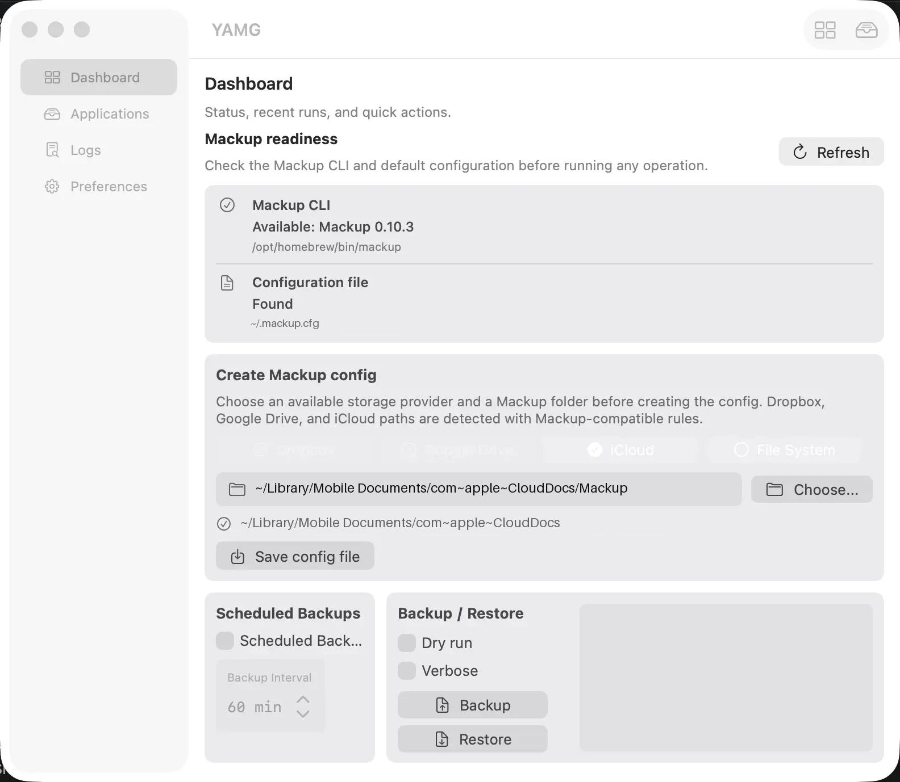
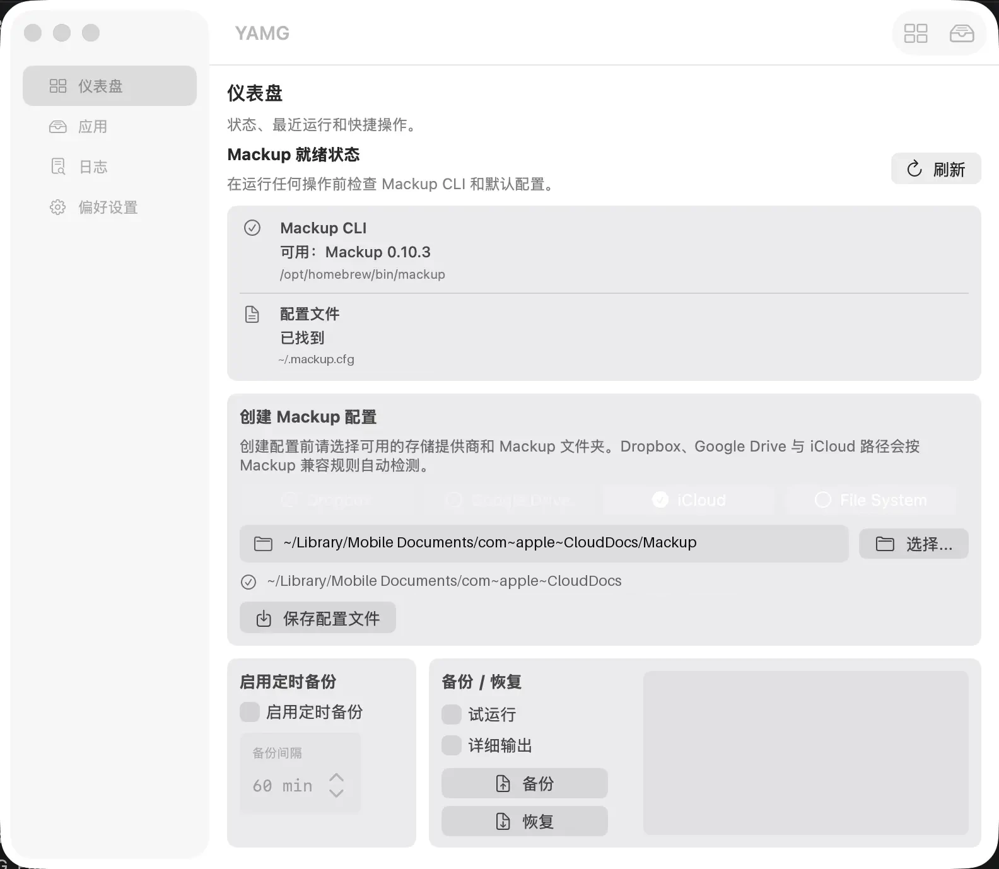

<div align="center">

**[English](#yamg--yet-another-mackup-gui) | [中文](#yamg--mackup-图形前端)**

</div>

---

<div align="center">



# YAMG — Yet Another Mackup GUI

**A native macOS GUI frontend for [Mackup](https://github.com/lra/mackup)**


</div>

## What is Mackup?

[Mackup](https://github.com/lra/mackup) is a free, open-source command-line tool that backs up your application settings and keeps them in sync across multiple computers — using Dropbox, Google Drive, iCloud, or any folder you choose.

Mackup supports **600+ applications** including VS Code, iTerm2, Git, Vim, Zsh, and many more. When you set up a new Mac, a single `mackup restore` puts all your configurations back in place.

> **Note on link mode:** macOS Sonoma (14) and later do not support symlinked preferences. Mackup's recommended mode is **copy mode** (`mackup backup` / `mackup restore`). YAMG defaults to copy mode and hides link mode behind a Preferences toggle.

## What is YAMG?

YAMG (Yet Another Mackup GUI) is a **free, open-source, native macOS app** that gives Mackup a graphical interface — no Terminal required.

YAMG does **not** reimplement sync logic. It detects your environment, helps you configure `.mackup.cfg`, and runs the Mackup CLI on your behalf. All backup, restore, and link operations are performed by Mackup itself.

> YAMG is a pure downstream consumer of Mackup. It does not fork or modify Mackup's source code.

## Features

| Feature | Description |
|---|---|
| **Mackup detection** | Automatically finds your Mackup installation (Homebrew, pipx, custom path) and shows version and status |
| **Config editor** | Create or edit `.mackup.cfg` without touching a text editor |
| **Storage providers** | Detect and select Dropbox, Google Drive, iCloud Drive, or any local/synced folder |
| **Application browser** | Browse all 600+ Mackup-supported apps installed on your Mac; toggle sync inclusion per app |
| **Backup & Restore** | One-click backup and restore with dry-run and verbose options |
| **Scheduled backups** | Set an automatic backup interval via launchd |
| **Log viewer** | View stdout/stderr, exit codes, and timestamps for every Mackup run |
| **Bilingual UI** | Full Chinese (Simplified) and English interface, follows system language |
| **Native SwiftUI** | Built with SwiftUI for macOS 12 Monterey and later; supports light and dark mode |

## Screenshots

<div align="center">
  
  <p><i>Dashboard</i></p>
</div>

## Requirements

- **macOS 12 Monterey** or later
- **Mackup 0.10.2+** — YAMG can install it for you via Homebrew or pipx
- **Python 3.9+** — required by Mackup

## Installation

> Distributable builds are not yet available. Clone the repository and build with Xcode.

```bash
git clone https://github.com/12dora/YAMG.git
cd YAMG
open YAMG.xcodeproj
```

Build and run the `YAMG` scheme in Xcode (macOS 12+).

### Install Mackup (if not already installed)

YAMG will detect whether Mackup is installed on first launch and offer to install it. You can also install it manually:

```bash
# Recommended: Homebrew
brew install mackup

# Alternative: pipx
pipx install mackup
```

## Usage

1. **Launch YAMG.** It detects your Mackup installation and `.mackup.cfg` automatically.
2. **Create Mackup config.** On the Dashboard, pick a storage provider (iCloud, Dropbox, Google Drive, or a custom folder) and save the config.
3. **Browse applications.** In the Applications tab, see which of your installed apps Mackup supports. Toggle apps in or out of sync.
4. **Backup.** Click Backup on the Dashboard to copy your configs to the Mackup folder.
5. **On a new Mac.** Install YAMG and Mackup, point to the same storage folder, then click Restore.

## Navigation

| Tab | Purpose |
|---|---|
| Dashboard | Environment status, storage config, backup / restore |
| Applications | Browse and toggle Mackup-supported apps |
| Logs | Full stdout/stderr history for every Mackup run |
| Preferences | CLI path, config path, language, link mode toggle |

## Contributing

Contributions are welcome. Please read the project guidelines before opening a pull request:

- Any new feature must map to an existing `mackup` command or `.mackup.cfg` field
- Translation PRs must include a `comment` for every string key
- PRs that add sync logic independent of Mackup CLI will not be merged

Bug reports, translation improvements, and documentation fixes are especially appreciated.

## License

YAMG is released under the **GNU General Public License v3.0 or later**, consistent with Mackup's own license.

## Acknowledgments

YAMG is built on top of [Mackup](https://github.com/lra/mackup) by [Laurent Raufaste](https://github.com/lra) and its many contributors. Without their work, YAMG would have nothing to front.

---

<div align="center">

**[English](#yamg--yet-another-mackup-gui) | [中文](#yamg--mackup-图形前端)**

</div>

---

<div align="center">


# YAMG — Mackup 图形前端

**[Mackup](https://github.com/lra/mackup) 的原生 macOS 图形界面**


</div>

## Mackup 是什么？

[Mackup](https://github.com/lra/mackup) 是一个免费、开源的命令行工具，能够将你的应用程序配置备份到 Dropbox、Google Drive、iCloud 或任意自选文件夹，并在多台电脑之间保持同步。

Mackup 支持 **600 余款应用**，包括 VS Code、iTerm2、Git、Vim、Zsh 等。当你设置新 Mac 时，只需一条 `mackup restore` 即可还原所有配置。

> **关于链接模式的说明：** macOS Sonoma（14）及更高版本不支持符号链接偏好设置。Mackup 推荐使用**复制模式**（`mackup backup` / `mackup restore`）。YAMG 默认使用复制模式，链接模式需要在偏好设置中手动开启。

## YAMG 是什么？

YAMG（Yet Another Mackup GUI）是一款**免费、开源的原生 macOS 应用**，为 Mackup 提供图形界面——无需使用终端。

YAMG **不**重新实现同步逻辑。它负责检测你的环境、帮助你配置 `.mackup.cfg`，并代你调用 Mackup CLI。所有备份、恢复、链接操作均由 Mackup 本身完成。

> YAMG 是 Mackup 的纯下游消费者，不 fork 也不修改 Mackup 的源码。

## 功能特性

| 功能 | 说明 |
|---|---|
| **Mackup 检测** | 自动查找 Mackup 安装位置（Homebrew、pipx、自定义路径），显示版本与状态 |
| **配置编辑器** | 无需打开文本编辑器即可创建或修改 `.mackup.cfg` |
| **存储提供商** | 自动检测并选择 Dropbox、Google Drive、iCloud Drive 或任意本地/同步文件夹 |
| **应用浏览器** | 浏览本机已安装的全部 600+ 款 Mackup 支持应用，可逐个切换同步开关 |
| **备份与恢复** | 一键备份与恢复，支持试运行与详细输出模式 |
| **定时备份** | 通过 launchd 设置自动备份间隔 |
| **日志查看器** | 查看每次 Mackup 运行的 stdout/stderr、退出码与时间戳 |
| **双语界面** | 完整支持简体中文与英文，跟随系统语言 |
| **原生 SwiftUI** | 基于 SwiftUI 构建，支持 macOS 12 Monterey 及更高版本，适配浅色与深色模式 |

## 屏幕截图

<div align="center">
  
  <p><i>仪表盘</i></p>
</div>

## 系统要求

- **macOS 12 Monterey** 或更高版本
- **Mackup 0.10.2+** — YAMG 可通过 Homebrew 或 pipx 帮你一键安装
- **Python 3.9+** — Mackup 运行所需

## 安装

> 目前尚无预构建安装包。请克隆仓库后使用 Xcode 构建。

```bash
git clone https://github.com/12dora/YAMG.git
cd YAMG
open YAMG.xcodeproj
```

在 Xcode 中构建并运行 `YAMG` scheme（需要 macOS 12+）。

### 安装 Mackup（如尚未安装）

YAMG 首次启动时会自动检测 Mackup 是否已安装，并提供一键安装选项。也可手动安装：

```bash
# 推荐：Homebrew
brew install mackup

# 备选：pipx
pipx install mackup
```

## 使用方法

1. **启动 YAMG。** 自动检测 Mackup 安装状态与 `.mackup.cfg`。
2. **创建 Mackup 配置。** 在仪表盘中选择存储提供商（iCloud、Dropbox、Google Drive 或自定义文件夹），保存配置。
3. **浏览应用。** 在"应用"标签页查看本机已安装的 Mackup 支持应用，按需开关同步。
4. **备份。** 点击仪表盘的"备份"按钮，将配置复制到 Mackup 文件夹。
5. **新 Mac 上恢复。** 安装 YAMG 与 Mackup，指向相同的存储文件夹，点击"恢复"即可。

## 导航结构

| 标签页 | 用途 |
|---|---|
| 仪表盘 | 环境状态、存储配置、备份 / 恢复操作 |
| 应用 | 浏览并切换 Mackup 支持的应用 |
| 日志 | 每次 Mackup 运行的完整 stdout/stderr 历史 |
| 偏好设置 | CLI 路径、配置文件路径、语言、链接模式开关 |

## 贡献

欢迎贡献代码。提交 Pull Request 前请阅读项目规范：

- 任何新功能必须对应已有的 `mackup` 命令或 `.mackup.cfg` 字段
- 翻译 PR 必须为每个字符串 key 提供 `comment`
- 独立于 Mackup CLI 实现同步逻辑的 PR 不会被合并

尤其欢迎 Bug 报告、翻译改进和文档修复。

## 许可证

YAMG 基于 **GNU 通用公共许可证 v3.0 或更高版本**发布，与 Mackup 自身的许可证保持一致。

## 致谢

YAMG 建立在 [Laurent Raufaste](https://github.com/lra) 及众多贡献者开发的 [Mackup](https://github.com/lra/mackup) 之上。没有他们的工作，YAMG 便无从谈起。
